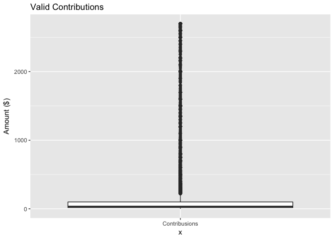
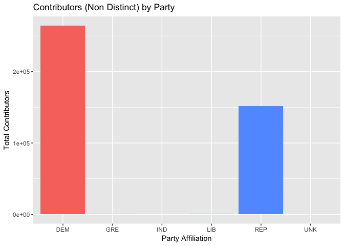
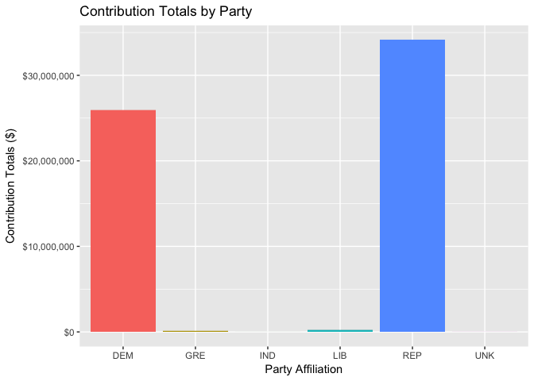
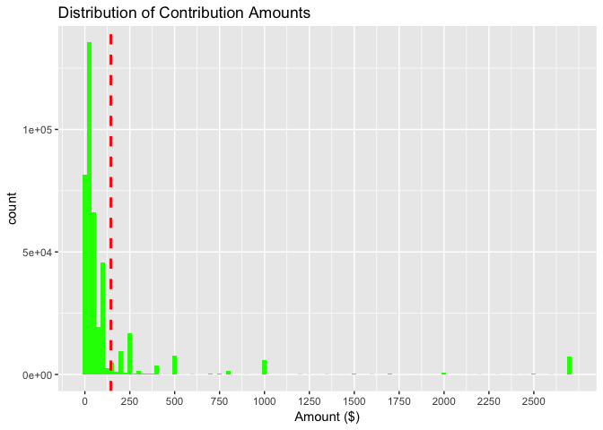
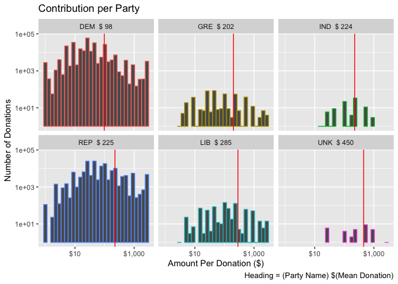
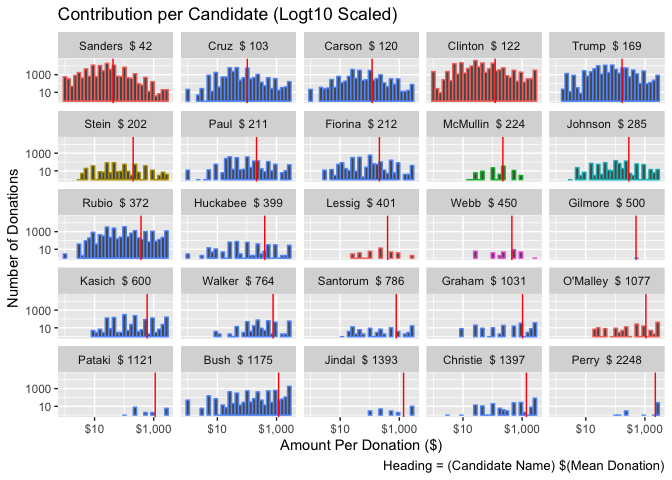
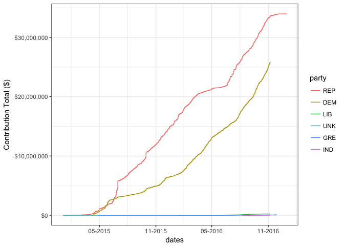
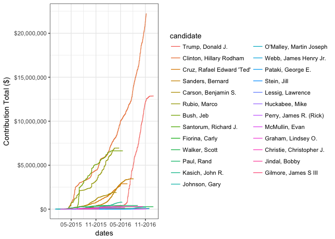
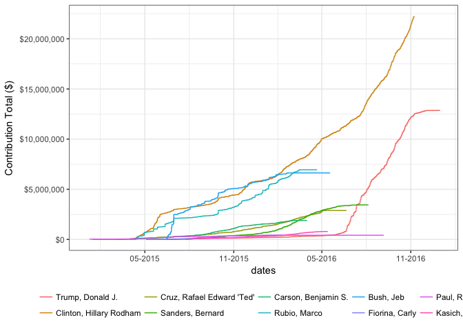
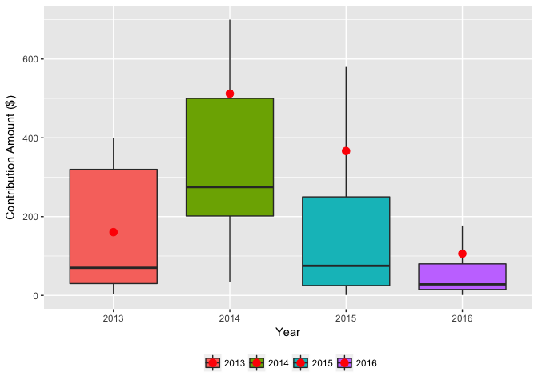

# | Evaluating Presidential Election Donors \n
| from State of Florida\n

Jason Carter  
3 Janaury 2018  


# Introduction

For this project, I chose to work with one of the data sets suggested by Udacity. The dataset is Financial Contributions to Presidential Campaigns for the State of Florida.  I chose this dataset as elections interest me, and I live in the State of Florida. The data comes directly from the Federal Election Commission’s website.

The data is provided in a ZIPPED, CSV file.   The CSV layout is provided by the Federal Election Commision as documented below. 


# Data Load

I had some issues loading the data due to a trailing comma on the data rows, but not on the header row, which caused data shifting and made a complete mess of the dataframe.   I found another project had the same issue and used a method to read the headers and adjust the data load accordingly (https://github.com/winkelman/udacity-dand-eda/blob/master/project.Rmd)   This method was the most complete I could find in my research so I applied the same method from that project.

Once loaded, we can see that the dataset contains 426057 rows with 18 columns which matches the data dictionary provided by the FEC: ftp://ftp.fec.gov/FEC/Presidential_Map/2016/DATA_DICTIONARIES/CONTRIBUTOR_FORMAT.txt

## Source Clean Up

This is a relatively large data set, and there are many fields that we just don't need for our analysis.  I will drop those columns to make the data a bit more manageable as well as rename the remaining ones to be more user friendly.

**Note:** It may seem I have taken important data fields out, but I will rejoin those using complete dataset based off of zip code below.


```r
#### Get just what we want
df.data <- subset(df.Export, select=c("cand_id", "cand_nm", "contbr_nm","contbr_zip", 
                                        "contbr_employer", "contbr_occupation",
                                        "contb_receipt_amt", "contb_receipt_dt"))

#### Friendly Name Them 
names(df.data) <- c("can_id", "candidate", "name", "zip",
                      "employer", "occupation", "amount", 
                      "date")
summary(df.data)
```

```
##        can_id                           candidate     
##  P00003392:184378   Clinton, Hillary Rodham  :184378  
##  P60007168: 82523   Sanders, Bernard         : 82523  
##  P80001571: 78970   Trump, Donald J.         : 78970  
##  P60006111: 29153   Cruz, Rafael Edward 'Ted': 29153  
##  P60006723: 20472   Rubio, Marco             : 20472  
##  P60005915: 16074   Carson, Benjamin S.      : 16074  
##  (Other)  : 14487   (Other)                  : 14487  
##                 name             zip           
##  LINGOR, MARGARET :   294   Min.   :        3  
##  MCGUINNESS, DIANE:   261   1st Qu.:321632264  
##  SAIFF, IVAN      :   259   Median :331313214  
##  BAILEY, ANGELA   :   237   Mean   :263365576  
##  NASH, SANDY      :   218   3rd Qu.:336105620  
##  STANLEY, ANTHONY :   218   Max.   :349978929  
##  (Other)          :424570   NA's   :6          
##                   employer                      occupation    
##  RETIRED              : 85832   RETIRED              :136253  
##  N/A                  : 66325   NOT EMPLOYED         : 33103  
##  SELF-EMPLOYED        : 29404   INFORMATION REQUESTED: 19901  
##  NONE                 : 24707   ATTORNEY             : 10115  
##  INFORMATION REQUESTED: 20037   PHYSICIAN            :  6071  
##  (Other)              :199488   (Other)              :220553  
##  NA's                 :   264   NA's                 :    61  
##      amount                date       
##  Min.   :-20000.0   12-JUL-16:  6876  
##  1st Qu.:    15.0   11-JUL-16:  6092  
##  Median :    30.0   06-JUL-16:  3752  
##  Mean   :   136.2   29-FEB-16:  3398  
##  3rd Qu.:   100.0   19-JUL-16:  3106  
##  Max.   : 20000.0   31-OCT-16:  3097  
##                     (Other)  :399736
```

## Donation Amounts
Looking at the summary I see the max is \$20,000 which is above the FEC max of $2700, and the minimum is negative at -\$20,000.  Lets look at it.

<!-- -->

Immediately I see that there are negative numbers in the amount column, which the FEC data dictionary shows as refunds, let take out those and anything above the statutory giving limit of $2700.   Note, in a more in-depth investigation I would want to remove the refund AND the matching donation, but that level of matching is not necesarry for my purposes here.


<!-- -->


## Zip Codes
If we want to plot this data on a map for visual analysis, we'll need to standardize the zip code as it currently has a mix of 5 and 9 digit zip-code.  Since our analysis won't make sense at that level of specicifity, we'll standardize to 5.    


```r
## Strip all except first 5 characters
df.data$zip <- substring(df.data$zip, 1, 5)
```


```r
### Let visually check ZipCodes
data(zip_codes)
map<-get_map(location='united states', zoom=4, maptype = "terrain",
             source='google',color='color')

map.data<-unique(subset(inner_join(df.data, zip_codes, "zip"), select=c("longitude", "latitude")))

ggmap(map) + 
  geom_point(
    data=map.data,      
    aes( x=longitude, y=latitude), color="red" ,
    alpha=.5, na.rm = T)  + 
        scale_color_gradient(low="beige", high="blue")
```

<!-- -->

Looking here, we know these errand dots are not proper.  Digging into zip-codes. I find that zipcodes between 32000 and 34999 are proper for Florida. (http://www.zipcodestogo.com/Florida/) All others I will remove.   

Some of those donations could likely be by members of the armed services or simply living part time in other states, I'll look at that too.


```
## # A tibble: 79 x 3
## # Groups:   city [78]
##              city state count
##             <chr> <chr> <int>
##  1        Wayland    OH    13
##  2       New York    NY     8
##  3         Draper    VA     7
##  4          Milan    IL     7
##  5 Fort Blackmore    VA     6
##  6      Irvington    VA     5
##  7     Loganville    GA     5
##  8        Chelsea    AL     4
##  9    Southampton    NY     4
## 10     Washington    DC     4
## # ... with 69 more rows
```

Looking at these, I don't see any indication of any specific reason they should be in there, but for the sake and double check with our map again.


<!-- -->

## Date Format
Lets update the dates to something more usable so we can evaluate donations against a calendar of specific events, such as state primaries, significant polls and other date based items.


```
##         Min.      1st Qu.       Median         Mean      3rd Qu. 
## "2013-10-01" "2016-02-27" "2016-06-13" "2016-05-17" "2016-08-30" 
##         Max. 
## "2016-12-31"
```

# Enhance Data

## Party Affiliation
One of the questions I'm interested in is how donations to political parties are distributed across the state.  My initial guess is that Metropolitan areas such as Miami, Orlando and Tampa will have higher Democratic or left leaning parties, whereas more rural cities/counties will lean more Republican.   

Due to that, I need to be able to match candidates to their sponsoring party.   Using the FEC website as my source again, I found the Candidate Summary page which list Candidates, their political partys, and importantly their FEC candidate_id which is also is my primary FEC dataset which will make the matchup very easy.


```
## # A tibble: 6 x 2
##    party  count
##   <fctr>  <int>
## 1    DEM 264213
## 2    REP 151852
## 3    LIB    810
## 4    GRE    466
## 5    IND     93
## 6    UNK     32
```

<!-- -->

A quick looks shows lots of Democratic donations
<!-- -->

A further look shows HIGHER Republican donations, interesting.

## County Data
In order to map the data into something useful on the state level, I'm have aggregated each zip-code into their respective counties, which should make the visual more interesting. 


<!-- -->
Looks like a valid Florida data set to me.


```
##       fips                    city               county    state    
##  Min.   :12001   Miami          : 100   Miami-Dade  :133   FL:1548  
##  1st Qu.:12033   Orlando        :  64   Hillsborough:101   GA:   1  
##  Median :12083   Tampa          :  62   Broward     : 91            
##  Mean   :12070   Jacksonville   :  54   Orange      : 85            
##  3rd Qu.:12099   Fort Lauderdale:  47   Palm Beach  : 78            
##  Max.   :12133   Pensacola      :  38   Pinellas    : 76            
##                  (Other)        :1184   (Other)     :985            
##      zip               latitude       longitude               geometry   
##  Length:1549        Min.   :24.57   Min.   :-87.48   MULTIPOLYGON :1549  
##  Class :character   1st Qu.:26.84   1st Qu.:-82.48   epsg:NA      :   0  
##  Mode  :character   Median :28.08   Median :-81.73   +proj=aeqd...:   0  
##                     Mean   :28.15   Mean   :-82.02                       
##                     3rd Qu.:29.34   3rd Qu.:-80.69                       
##                     Max.   :30.97   Max.   :-80.04                       
## 
```


# Univariate Exploration

Now we have properlty formatted data, lets see what features we ended up with and some stats:

From this summary we can see Hillary Clinton received the most donations, with Miami county being the biggest donating county.  Not suprisingly retired people are more politically active.  Median contribution amount was:  $35 while the average (mean) amount was higher at $145.


```
##      zip                  can_id                           candidate     
##  Length:416592      P00003392:182001   Clinton, Hillary Rodham  :182001  
##  Class :character   P60007168: 81821   Sanders, Bernard         : 81821  
##  Mode  :character   P80001571: 76353   Trump, Donald J.         : 76353  
##                     P60006111: 28071   Cruz, Rafael Edward 'Ted': 28071  
##                     P60006723: 18669   Rubio, Marco             : 18669  
##                     P60005915: 15790   Carson, Benjamin S.      : 15790  
##                     (Other)  : 13887   (Other)                  : 13887  
##                name                         employer     
##  LINGOR, MARGARET:   294   RETIRED              : 83520  
##  SAIFF, IVAN     :   259   N/A                  : 66217  
##  BAILEY, ANGELA  :   237   SELF-EMPLOYED        : 28938  
##  NASH, SANDY     :   218   NONE                 : 24649  
##  STANLEY, ANTHONY:   218   INFORMATION REQUESTED: 19928  
##  CAMP, PREMA J   :   214   (Other)              :193078  
##  (Other)         :415152   NA's                 :   262  
##                  occupation         amount            date           
##  RETIRED              :133824   Min.   :   1.0   Min.   :2013-10-01  
##  NOT EMPLOYED         : 33061   1st Qu.:  19.0   1st Qu.:2016-02-27  
##  INFORMATION REQUESTED: 19796   Median :  35.0   Median :2016-06-13  
##  ATTORNEY             : 10020   Mean   : 144.5   Mean   :2016-05-17  
##  PHYSICIAN            :  6009   3rd Qu.: 100.0   3rd Qu.:2016-08-30  
##  (Other)              :213821   Max.   :2700.0   Max.   :2016-12-31  
##  NA's                 :    61                                        
##      party             fips                    city       
##  DEM    :264016   Min.   :12001   Miami          : 37572  
##  REP    :151201   1st Qu.:12033   Fort Lauderdale: 21324  
##  LIB    :   786   Median :12086   Tampa          : 15236  
##  GRE    :   464   Mean   :12071   Orlando        : 12963  
##  IND    :    93   3rd Qu.:12099   Naples         : 12125  
##  UNK    :    32   Max.   :12133   Jacksonville   : 11931  
##  (Other):     0                   (Other)        :305441  
##           county       state          latitude       longitude     
##  Miami-Dade  : 48678   FL:416592   Min.   :24.57   Min.   :-87.48  
##  Palm Beach  : 40969   GA:     0   1st Qu.:26.30   1st Qu.:-82.40  
##  Broward     : 39623               Median :27.71   Median :-81.48  
##  Pinellas    : 24490               Mean   :27.68   Mean   :-81.58  
##  Hillsborough: 23894               3rd Qu.:28.66   3rd Qu.:-80.30  
##  Orange      : 21048               Max.   :30.97   Max.   :-80.04  
##  (Other)     :217890                                               
##           geometry     
##  MULTIPOLYGON :416592  
##  epsg:NA      :     0  
##  +proj=aeqd...:     0  
##                        
##                        
##                        
## 
```

In our plots below, I have plotted the data on a histogram.  We can quickly see a long tail distribution of the data as the summary above suggest with the lower median (red line).   Interestingly we see a few spikes around \$100, \$500, \$1000 and finally at the far right with the maximum of $2700 which all seem like nice rounded off, budgetable numbers.

In the second plot below, With a quick log10 tranformation on the amounts we can see a somewhat normal distribution, but still a great deal below the mean (red line).

<!-- -->

<!-- -->

To further our analysis, I have broke the donations down by party.   Each historgram shows a single party and their donations.    The title of each is annotated with the party's short indicator, as well as the mean donation amount.   The mean has also been displayed onto the histogram to so that relationship between mean and number of donations can be visualized.   The histograms are ordered smallest to largest by the average donation size.

<!-- -->

Taking the breakdown one step further, can present the same data at the Candidate level with the headings now showing the Candidate's last name and mean donation.   All candidates of the same party are colored the same to assist with visual evaluation.

<!-- -->

## Over Time

<!-- -->

Using this line chart based on party fund raising by date we see the Republicans clearly out-raised the Democrats from very early in the race. The numbers for the Democrats and Republicans are so large, they eclipes all other parties.   Since the fund raising started so early with no visual benefit, I trimmed the plot down to just the final two years of the campaign.

<!-- -->

This isn't super useful as it has TOO much information, I'm going to reduce down the field of candidates to only the TOP 10 fundraisers and move the legend out of the way.

<!-- -->

Breaking it down into individual candidates, we can see that, while Clinton soared in individual fundraising, a good number of the Republican candidates did quite well, contributing to the party's over all fund raising numbers. I think this is interesting to show how roll-up data can hide important details like this.


<!-- -->
Adding more context clues, this graph becomes a bit more useful to understand the timelines.  We can see a few candidates drop off after Super Tuesday, and for the most part, all others fall off after their respective Parties Convention.    


# Bi and Multivariate Analysis

Lets use the hetcor package and produce a Pearson correlation matrix to see if it can give us any insight about correlations we should to start plotting.


```
## 
## Two-Step Estimates
## 
## Correlations/Type of Correlation:
##           candidate     amount       date      party     county
## candidate         1 Polyserial Polychoric Polychoric Polychoric
## amount     -0.02868          1 Polyserial Polyserial Polyserial
## date        0.05465    -0.2052          1 Polychoric Polychoric
## party        0.4406     0.1913    -0.2941          1 Polychoric
## county      0.02106    0.02496  -0.007587    0.03418          1
```

Party, amount, and date are the only variables that have a correlation coefficient above 0.10 that would suggest any type of correlation.  I'm a bit surprised that county to party is not more correlated.  

<!-- -->

Looking at donation counts over the months by year we can see noticeable amounts of donations starting rolling in April of 2015 with 2016 having the majority of donations.

<!-- -->

Here we can see the mean (red dots) varying high during the early years of the election cycle which makes sense as candidate will likely get large personal donations from friends, families and insiders first before hitting the campaign trail which would start to roll in the smaller personal dontations, which also explains the size of the 2016 box as the donations are concentrated in a much more compact range.

<!-- -->


```
## # A tibble: 6 x 4
##    party      mean median      n
##   <fctr>     <dbl>  <dbl>  <int>
## 1    UNK 450.00000    250     32
## 2    LIB 285.31380    100    786
## 3    REP 224.71700     50 151201
## 4    IND 223.57527    250     93
## 5    GRE 201.99616     50    464
## 6    DEM  98.02769     25 264016
```

This box plot and graph simply show us what we found earlier in the Histograms that Democrats have lower donation amounts from greater number of donors, whereas Republicans have higher mean donations from fewer donors, nothing too interesting.


## Metro versus Rural

I'm curious to see how donors differ from different parts of the states.   I spent way too much time figuring out this visual, but it does a good job of showing where various party donations come from.


<!-- -->
This map does a good job of showing distribution but not comparison to others.  Lets try it a different way.


<!-- -->

Looking at this, we can see that my hunch was pretty accurate.  Most metropolitan areas are covered with Democratic donations as well as military towns Pensacola, Eglin Air Force Base and Jacksonville.   The majority of the blue markers show up in more rural areas, or the more expensive retirement areas around Ft. Lauderdale.  


```
## # A tibble: 1,184 x 3
## # Groups:   city [545]
##                city  party  donors
##              <fctr> <fctr>   <dbl>
##  1            Miami    DEM 1856468
##  2            Miami    REP  691288
##  3  Fort Lauderdale    DEM  617271
##  4          Orlando    DEM  374617
##  5            Tampa    DEM  355488
##  6     Jacksonville    DEM  279497
##  7     Jacksonville    REP  207747
##  8  Fort Lauderdale    REP  169423
##  9 Saint Petersburg    DEM  156674
## 10          Orlando    REP  155103
## # ... with 1,174 more rows
```

And the numbers pretty much confirm the visual.  Knowing about the various areas of the state these numbers are not surprising.


# Final Plots and Summary

Of all the plots included in this analysis.  I found these to be the most interesting.

## Plot One
<!-- -->
### Plot One Description

This plot show the number of donors across the state. We see stronger support of Democratic candidate towards the larger metropolian areas, where as areas with high retirees and rural indivdiauls can be seen supporting the Republican party.

## PLot Two
<!-- -->

### Plot Two Description
I find multi-faceted plots to be visaully appealing yet very informative.  With this plot we can quickly see which party a candidate is with simply by its color, the candidates mean donation by the red line, and the over all distribution of donation amounts by the underlying histogram.    With this layout we can easily get an idea of which economical section of society supported each candidate.   

## Plot Three 
<!-- -->

### Plot Three Description
This third plot shows a representative of the donors per party by the average and quartiles of their donations.   Comparing Democrat and Republicans we see that the upper range of the Republicans is more than double of that of the Democrats.

# Reflections 

During the initial phases of this exploration I had issues loading the data and spent quite a bit of time figuring our the data format.   Having originally fixed the issue in an external program, I later came back and figured out the R base fix for the problem, which is included in this analysis. I had the most frustration with the Map based plot.   Originally I used another package that had county shapes, which I could fill with color based on number of donors, but I wouldn't be able to easily show counties that had a mix of parties, which lead me to the map based solution above an actual map and coordinates of each city.    

Working with the data for each plot provided many opportunitis to understand how the data is laid out and used inside a R data frame, which did a great job of furthering my understanding of the various packages available for data explordation.

In searching for problems with this data I found others doing similar comparision where they enriched the data with County population data, gender data (based off donor's first name), and even one with employer data based on employer name, all of those additional data points could be used for a much more in-depth exploration.

Based on my exploration, some time could be spent to attempt to correlate the refunds to original donations to make the data cleaner and more representative.   I could be interesting, but I have a hunch it wouldn't be that surprising, to correlate donation amount by City to understand how donation amounts vary per the different areas of the states.


